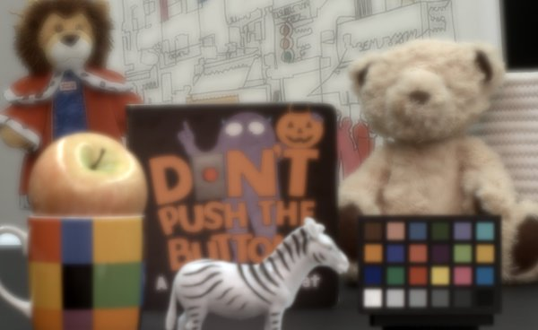
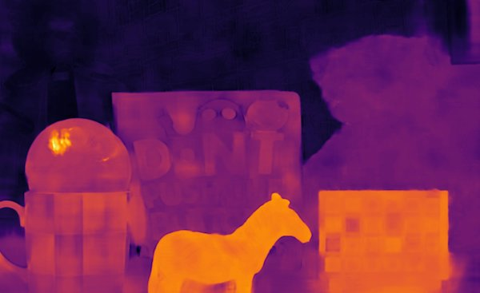

## Project

This is the code repository
for [Depth from Defocus with Learned Optics for Imaging and Occlusion-aware Depth Estimation (ICCP 2021)](http://www.computationalimaging.org/publications/deepopticsdfd/)
.

## Conda environment

Run the following command to create the conda environment.

```shell
conda create --name learned_defocus python=3.8 kornia pytorch-lightning=1.0.2 cudatoolkit=11.0 pytorch=1.7 \
  numpy scipy numba scikit-image torchvision matplotlib opencv pytest openexr-python -c pytorch -c conda-forge -y
pip install git+https://github.com/cheind/pytorch-debayer@v1.0 --no-deps
```

## Dataset for training

Download the datasets
from [SceneFlow](https://lmb.informatik.uni-freiburg.de/resources/datasets/SceneFlowDatasets.en.html)
and [DualPixel](https://github.com/google-research/google-research/blob/master/dual_pixels/README.md). To complete the
sparse depth map, the central view of DualPixel dataset is filled
with a python port of [NYU Depth V2's toolbox](https://cs.nyu.edu/~silberman/datasets/nyu_depth_v2.html). After downloading the datasets,
place them under `data/training_data` directory. You can change the path to the dataset
in [dataset/dualpixel.py](dataset/dualpixel.py) and [dataset/sceneflow.py](dataset/sceneflow.py).

## How to run the training code

```shell
python snapshotdepth_trainer.py \
  --gpus 4 --batch_sz 3 --distributed_backend ddp  --max_epochs 100  --optimize_optics  --psfjitter  --replace_sampler_ddp False
```

## Checkpoint and captured data

An example of a trained checkpoint and a trained DOE is available from
GoogleDrive ([checkpoint](https://drive.google.com/file/d/1ZdenyEUhFq497QKQLI0VgIXYfLkMI778/view?usp=sharing)
and [image](https://drive.google.com/file/d/1rW6TspPHvpJSGFvxF4eP_gxroLy7Ico7/view?usp=sharing)).

## How to run the inference code on a real captured data

Download the captured image and the checkpoint, and place them in `data` directory.

```shell
python run_trained_snapshotdepth_on_captured_images.py \
  --ckpt_path data/checkpoint.ckpt \
  --captimg_path data/captured_data/outdoor1_predemosaic.tif 
```

This inference code runs on CPU.

Example input and output:





## Raw data for the fabricated DOE

The design for the fabricated DOE is
available [here](https://drive.google.com/file/d/1kQtJn0rgH26193gOLoTiOfz8EKXZLIn4/view?usp=sharing). Unit is in meter,
and the pixel size is 1&mu;m.

## Citation

Hayato Ikoma, Cindy M. Nguyen, Christopher A. Metzler, Yifan Peng, Gordon Wetzstein, Depth from Defocus with Learned
Optics for Imaging and Occlusion-aware Depth Estimation, International Conference on Computational Photography 2021

```
@article{Ikoma:2021,
author = {Hayato Ikoma and Cindy M. Nguyen and Christopher A. Metzler and Yifan Peng and Gordon Wetzstein},
title = {Depth from Defocus with Learned Optics for Imaging and Occlusion-aware Depth Estimation},
journal = {IEEE International Conference on Computational Photography (ICCP)},
year={2021}
}
```

## Contact
Please direct questions to [hikoma@stanford.edu](hikoma@stanford.edu).

## Acknowledgement

We thank the open source software used in our project, which includes [pytorch](https://github.com/pytorch/pytorch),
[pytorch-lightning](https://github.com/PyTorchLightning/pytorch-lightning), [numpy](https://github.com/numpy/numpy),
[scipy](https://github.com/scipy/scipy), [kornia](https://github.com/kornia/kornia)
, [pytorch-debayer](https://github.com/cheind/pytorch-debayer), [matplotlib](https://github.com/matplotlib/matplotlib)
, [OpenCV](https://opencv.org/) and [Fiji](https://github.com/fiji/fiji).